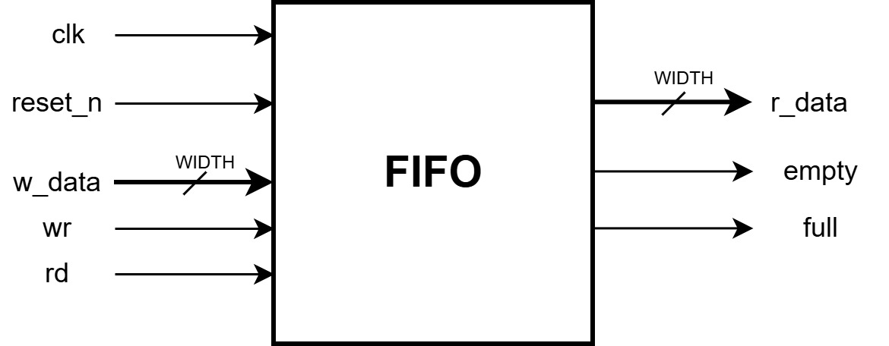

# About:
This is a circular buffer based FIFO implementation using SystemVerilog.

## Project Status: 
- Basic implementation is finished, with some basic tests and checkers to verify the basic functionality of the FIFO.

## Upcoming Work: 
- Perform more functional verification using either OOP concepts of SysVerilog or UVM, in order to have more flexibility on Verification work.
- Synthesis the RTL code using VIVADO Tool, or online tool EDAPlayGround.

## File Structure: 
    ./
    ├── do
    │   ├── sim_steps.do
    │   └── waves.do
    ├── doc
    |   └── fifo_block.drawio
    ├── Makefile
    ├── README.md
    ├── sim
    ├── rtl
    │   ├── design.sv
    │   ├── dummy_module.v
    │   └── filelist.f
    └── tb
       ├── filelist.f
       ├── tb_defines.sv
       ├── tb_pkg.sv
       ├── tb_tasks.sv
       └── testbench.sv

## Contacts:
- abderrahimelhamzi.dev@gmail.com

